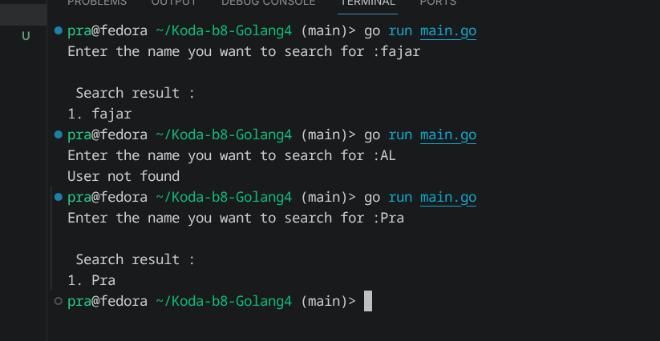

# User Search - Golang

## Description

A simple Go program to search for users using a keyword.

## Features

* Search users by keyword
* Uses strings.Contains() for searching
* Returns matching users
* Displays a message if no user is found

## Concepts

* Function
* Package
* Slice
* for range
* if
* append()
* strings.Contains()
* len()

## Demo 

